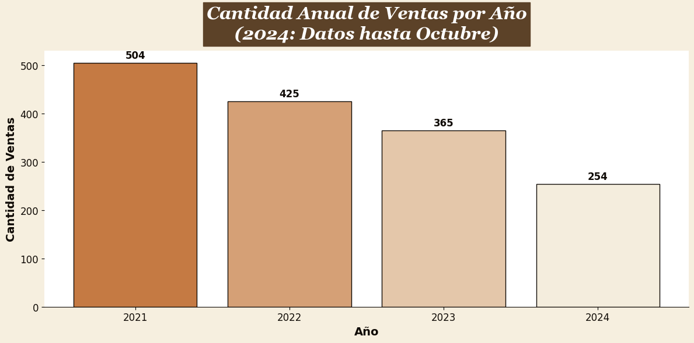
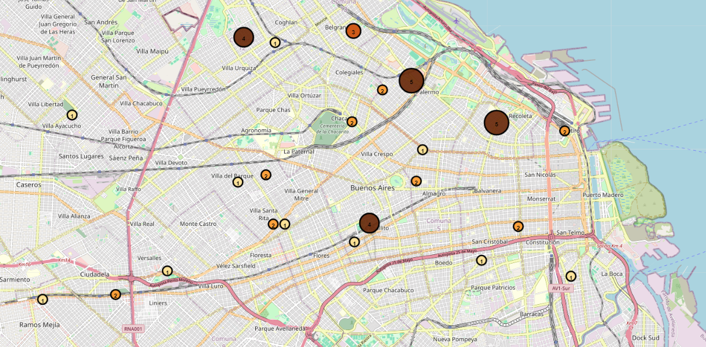

# Tierra Adentro Artesanal

Análisis de negocio y dashboard ejecutivo sobre un emprendimiento artesanal argentino que comercializa en Mercado Libre e Instagram. El proyecto combina Python, SQL y Streamlit para traducir datos comerciales en decisiones concretas sobre rentabilidad, mix de productos, geografía de clientes y operación logística.

## Qué hace valioso este proyecto

- No se queda en la visualización: conecta datos con decisiones de pricing, marketing, logística y fidelización.
- Plantea una lectura honesta del negocio en contexto inflacionario, separando crecimiento nominal de desempeño real.
- Presenta un caso end-to-end de portfolio: datos, análisis, storytelling, dashboard y plan de acción.
- Usa una estética coherente con la marca y una narrativa apta para destacar en GitHub o LinkedIn.

## Hallazgos principales

- Las unidades vendidas caen con fuerza entre 2021 y 2024, aunque los ingresos nominales crecen por inflación.
- Sandalias sostienen el negocio, pero los accesorios premium aparecen como vía clara de diversificación rentable.
- La demanda se concentra en CABA, Buenos Aires y algunos focos urbanos del interior.
- La logística es aceptable, aunque con picos y horarios que pueden convertirse en cuello de botella.

## Vista previa

### Canal principal de venta


### Evolución de ventas


### Concentración geográfica en CABA


## Stack

- Python
- Streamlit
- SQLite
- Pillow
- Notebook exploratorio para análisis base

## Estructura del proyecto

```text
.
├── data/
│   ├── argentina_provincias.geojson
│   └── mercado_libre.db
├── images/
│   └── ...gráficos y capturas del caso
├── notebooks/
│   └── proyecto_tierra_adentro.ipynb
├── streamlit_app/
│   ├── app.py
│   └── legacy/
│       └── dashboards exploratorios originales
├── dashboard_tierra_adentro.py
├── README.md
└── requirements.txt
```

## Cómo ejecutar

```bash
pip install -r requirements.txt
streamlit run streamlit_app/dashboard_tierra_adentro.py
```

## Qué muestra el dashboard

- **Visión general:** contexto del negocio, canales de venta y lectura ejecutiva.
- **Ventas:** evolución anual, ingresos, estacionalidad y horas pico.
- **Productos:** categorías dominantes, top ventas, ingresos por producto y colores.
- **Clientes:** concentración territorial, hotspots en CABA y perfil de compra.
- **Envíos:** tiempos promedio, distribución horaria y días de mayor carga.
- **Plan de acción:** recomendaciones concretas de negocio para crecer con mejor margen.

## Enfoque de portfolio

Este repositorio está preparado para comunicar tres cosas a la vez:

1. Capacidad técnica para organizar un proyecto de análisis de punta a punta.
2. Criterio para traducir visualizaciones en hipótesis comerciales y acciones.
3. Sensibilidad de producto y presentación para convertir un caso analítico en una pieza fuerte de marca personal.
